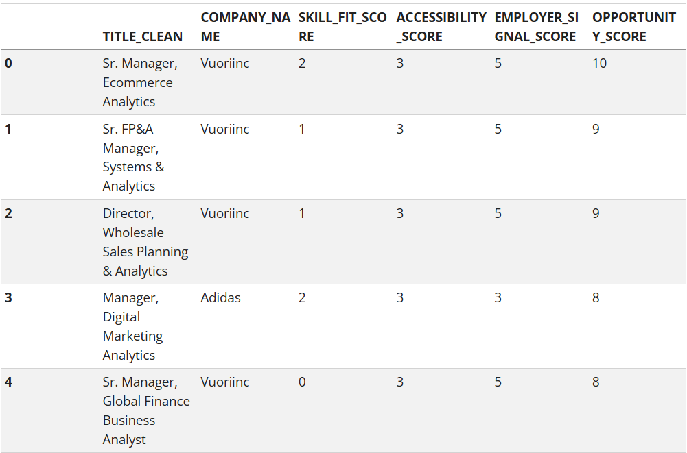

## Product framing

Our group developed a product for students interested in entering the apparel and fashion industry and seeking analytics-related opportunities. It helps them identify suitable job opportunities, assess skill gaps, and determine which skills to develop next. This analysis focuses on apparel and fashion employers under the North American Industry Classification System (NAICS) code 458 – Clothing, Clothing Accessories, Shoes, and Jewelry Retailers.

## Scope and data

Although the dataset included 504,208 job postings extracted from 21 parquet parts, only 19 had the NAICS 458 code and were usable for this evaluation, making this analysis fashion analytics market-focused rather than an assessment of the broader analytics industry. The dataset uses the following columns in this evaluation: ID, TITLE_CLEAN, COMPANY_NAME, COMPANY_CLEAN, SALARY_FROM, SALARY_TO, MIN_YEARS_EXPERIENCE, MAX_YEARS_EXPERIENCE, CITY_NAME, STATE_NAME, REMOTE_TYPE_NAME, SKILLS_LIST, SOFTWARE_SKILLS_LIST, NAICS_2022_3.

## Market Baseline

The market baseline examines the apparel and fashion industry demand, salary, location, working arrangement, and required experience for the selected analytics market. The results indicate that Business Intelligence (BI) and Data Analytics, along with Marketing and Customer Analytics, make up the most postings by functional analytics area. Job opportunities were concentrated in California, Massachusetts, and New York. 

Salary data was limited, but showed a range of approximately $85,000 to $160,000. Work arrangement was also missing details, showing hybrid and remote positions; onsite was not explicitly classified.

Experience data was also missing from our data; however, most opportunities did not require experience. 

Our findings suggest opportunities for analytics professionals across multiple areas within the fashion and apparel industry, while the small dataset size and incomplete job posting information limit the ability to generalize these results to the broader fashion and apparel industry.

## Skill-Gap Analysis

The Skill-Gap Analysis compares required employer skills with the current capabilities of the student, which our group used to test the model and assess our own skills. Skills are rated from 1 (Beginner) to 5 (Expert); each skill is then compared against market demand, which is used to set the “Target Level”. From there, the user can see the gap between their skill level and the target level, and is given a priority level for improvement. Power BI and SQL were the most frequently requested technical skills, each appearing in 7 of 19 job postings. Excel and Python each appeared in 5 postings, although the team demonstrated stronger proficiency in Excel than Python.  

Our Skill Gap Summary showed our group reported average proficiency scores of 2.75 in Power BI and 3.25 in SQL, indicating skills set to high priority. Excel and Python were set to moderate priority, although the team demonstrated stronger proficiency with these skills. All other skills, including Data Analysis, were identified as low priority.

## Final Analytics

The final analysis uses a rule-based Opportunity Scorecard to rank job postings according to skill fit, experience accessibility, and employer signal score. A scorecard was selected over a predictive model because the final dataset had only 19 postings, making it more vulnerable to overfitting. We found the highest-ranked position was the Senior Manager, Ecommerce Analytics role at Vuori, with an opportunity score of 10. The second and third highly ranked positions were Sr. FP&A Manager, Systems & Analytics at Vuori and Director, Wholesale Sales Planning & Analytics at Adidas.

The scorecard provides an intuitive method for prioritizing opportunities based on the student's current skill levels and the characteristics found in the job postings. However, evaluation of the scoring components showed us that the employer signal had the strongest influence on the final score, meaning companies with more postings were more likely to rank highly. With this in mind, and considering this is not a predictive model, the scorecard is best interpreted as a career prioritization tool.

## Recommendations 

Given this dataset and our Opportunity Scorecard, we recommend students focus their job search on Vuori and TJX, as they had multiple analytics-adjacent postings, making them the most attainable by volume. Adidas ranked third in posting volume, with positions relying more on skill fit rather than application volume. For location, students have the best chance of finding opportunity in California, Massachusetts, and New York.

Students should also focus on developing their Power BI and SQL skills, as they are the most in-demand skills. The third most important skill is Python, though less than half of these postings required it. In our group's assessment, Alyssa and Ankita should work on their Power BI skills, then move to SQL practice against our own filtered dataset. Sara should prioritize Power BI first, building on her existing Excel strength. Zech should focus on additional Power BI features and build on his existing SQL skills.

## Limitations 

As stated before, our working sample is 19 postings from a narrowly filtered search. These recommendations describe this specific sample, not the broader apparel analytics job market. Salary and remote work data were usable for only 4 of 19 postings each, so neither recommendation above can account for compensation or remote work preferences with much confidence. Lastly, the scorecard’s equal weighting of skill fit, accessibility, and employer signal is a modeling choice, not a validated weighting scheme.