# Product Framing

Our group developed a solution for students interested in entering the apparel and fashion industry and seeking analytics-related opportunities. Fashion retailers have leaned harder into data analytics in recent years [@oh2020], and the U.S. Bureau of Labor Statistics projects continued growth in analytics-related roles [@blsooh2025]. Job postings for these roles frequently call for SQL, Excel, and visualization tools like Tableau or Power BI, alongside analytical and communication skills [@ziprecruiter2026a], and the same postings show a fair amount of spread in pay and remote availability [@ziprecruiter2026b]. It helps them identify suitable job opportunities, assess skill gaps, and determine which skills to develop next. This analysis focuses on apparel and fashion employers under the North American Industry Classification System (NAICS) code 458 – Clothing, Clothing Accessories, Shoes, and Jewelry Retailers.

# Scope and Data

Although the dataset included 504,208 job postings extracted from 21 parquet parts, only 19 were usable for this evaluation after combining the NAICS 458 filter with a list of known apparel and fashion employers and a role-title match, making this analysis fashion analytics market-focused rather than an assessment of the broader analytics industry. The dataset uses the following columns in this evaluation: ID, TITLE_CLEAN, COMPANY_NAME, COMPANY_CLEAN, SALARY_FROM, SALARY_TO, MIN_YEARS_EXPERIENCE, MAX_YEARS_EXPERIENCE, CITY_NAME, STATE_NAME, REMOTE_TYPE_NAME, SKILLS_LIST, SOFTWARE_SKILLS_LIST, NAICS_2022_3.

| Step | Postings |
|---|---|
| Raw source (21 parquet parts) | 504,208 |
| NAICS 458 only | 18 |
| Known apparel/fashion employer only | 2,387 |
| NAICS 458 OR known employer (industry match) | 2,405 |
| Role title keyword match, any industry | 13,841 |
| Final filtered set (industry match AND role match) | 19 |

# Market Baseline

The market baseline examines the apparel and fashion industry demand, salary, location, working arrangement, and required experience for the selected analytics market. Job title, employer, and location are available for all 19 postings, but experience data is usable for only 9 postings and salary and work arrangement data are usable for only 4 postings each, so those smaller findings should be read with more caution. The 19 postings cover a fairly wide mix of roles, including analyst, business intelligence, ecommerce, merchandise, and senior analytics positions, and most titles appear only once.

[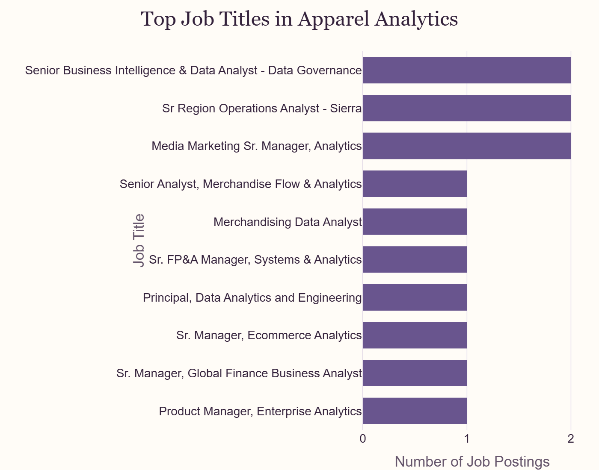](https://zechnschweitzer.github.io/ad688-fashion-apparel-evaluation-group7/market_baseline.html)

Grouping the 19 postings by functional focus shows BI and data analytics roles make up the largest share at 6 postings, followed by marketing and customer analytics with 5, merchandising and ecommerce with 3, finance and strategy analytics and operations analytics with 2 each, and product or engineering analytics with 1. Job opportunities were also concentrated among a small number of employers: Vuori and TJX each account for 5 postings, Adidas accounts for 3, and Ralph Lauren accounts for 2, while Nordstrom, Foot Locker, Michaels, and Macy's each contribute 1.

[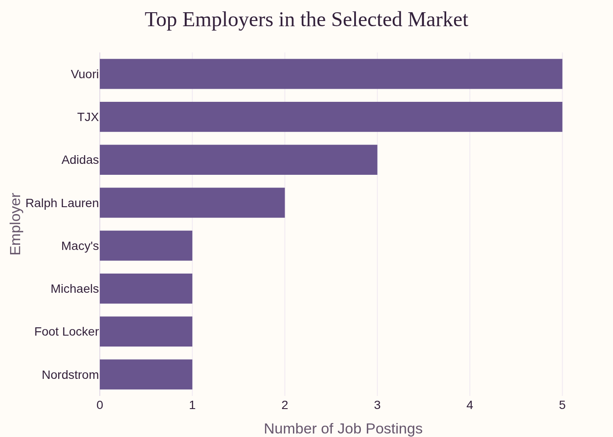](https://zechnschweitzer.github.io/ad688-fashion-apparel-evaluation-group7/market_baseline.html)

Geographically, California and Massachusetts each account for 5 postings, followed by New York with 4 and Oregon with 3. 

[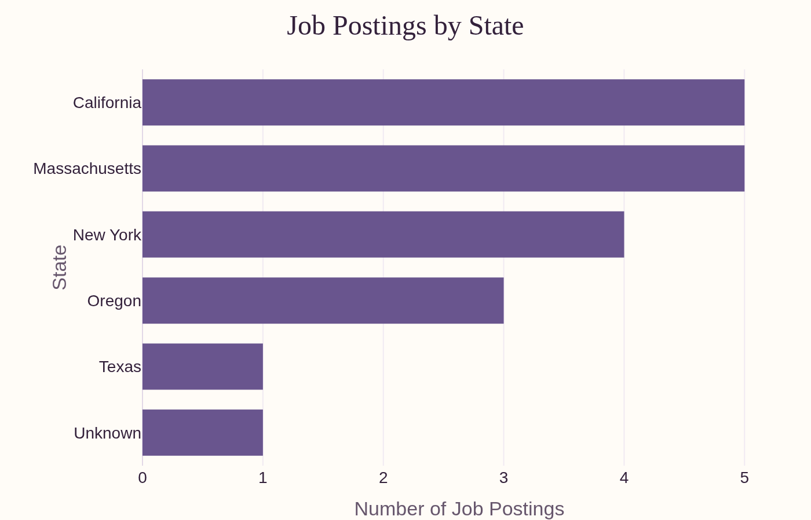](https://zechnschweitzer.github.io/ad688-fashion-apparel-evaluation-group7/market_baseline.html)

Salary data was limited to 4 of the 19 postings, with a range of approximately $85,000 to $161,000. Work arrangement data was also limited to 4 postings: 3 are classified as hybrid and 1 as fully remote, and no posting in the sample is explicitly classified as onsite.

[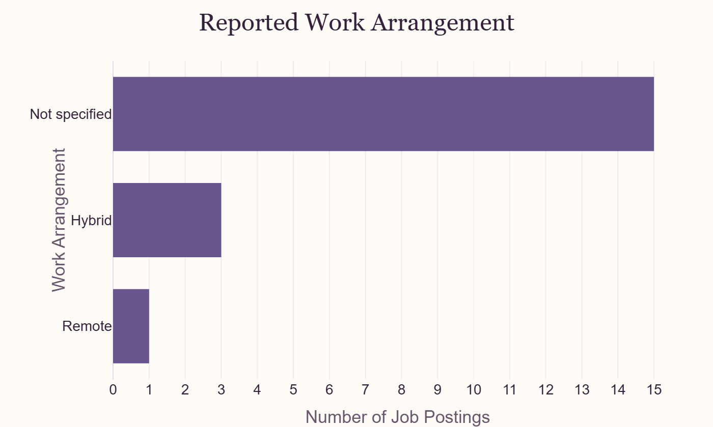](https://zechnschweitzer.github.io/ad688-fashion-apparel-evaluation-group7/market_baseline.html)

[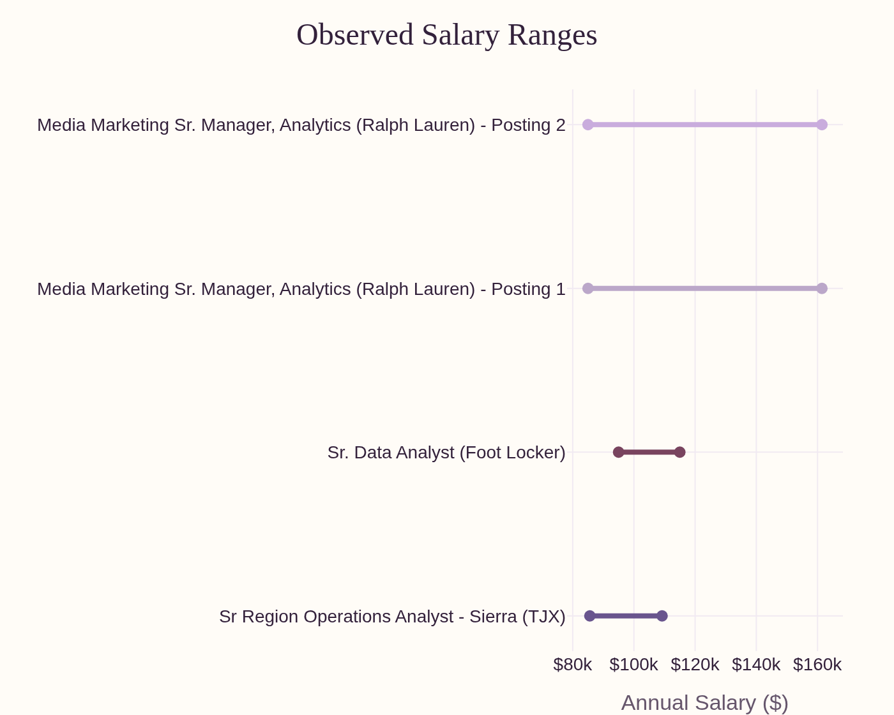](https://zechnschweitzer.github.io/ad688-fashion-apparel-evaluation-group7/market_baseline.html)

Minimum experience information is available for 9 of the 19 postings. Of those, 7 show a recorded minimum of 0 years and 2 show a minimum of 5 years, so most opportunities with a reported requirement do not require prior experience. 

[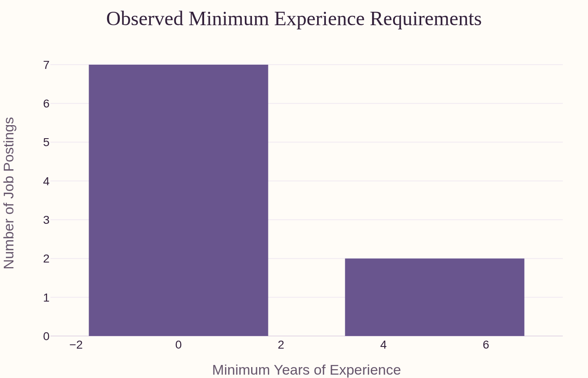](https://zechnschweitzer.github.io/ad688-fashion-apparel-evaluation-group7/market_baseline.html)

Our findings suggest opportunities for analytics professionals across multiple areas within the fashion and apparel industry, while the dataset size and incomplete job posting information limit the ability to generalize these results to the broader fashion and apparel industry.

# Skill-Gap Analysis

The Skill-Gap Analysis compares required employer skills with the current capabilities of the student, which our group used to test the model and assess our own skills. Skills are rated from 1 (Beginner) to 5 (Expert); each skill is then compared against market demand, which is used to set the “Target Level”. From there, the user can see the gap between their skill level and the target level, and is given a priority level for improvement. Power BI and SQL were the most frequently requested technical skills, each appearing in 7 of 19 postings, followed by Python and Microsoft Excel with 5 each and Digital Marketing with 4. The remaining skills, including Stakeholder Management, Project Management, and Data Analysis, each appeared in 2 to 3 postings.

| Skill | Market Demand | Target Level | Team Average | Gap | Priority |
|---|---|---|---|---|---|
| Power BI | 36.8% | 5 | 2.75 | 2.25 | High |
| SQL | 36.8% | 5 | 3.25 | 1.75 | High |
| Python | 26.3% | 4 | 2.75 | 1.25 | Moderate |
| Digital Marketing | 21.1% | 4 | 2.75 | 1.25 | Moderate |
| Excel | 26.3% | 4 | 4.25 | -0.25 | Low |
| Stakeholder Mgmt | 15.8% | 3 | 3.50 | -0.50 | Low |
| Project Mgmt | 15.8% | 3 | 3.50 | -0.50 | Low |
| Data Analysis | 15.8% | 3 | 4.00 | -1.00 | Low |

<!-- -->  

[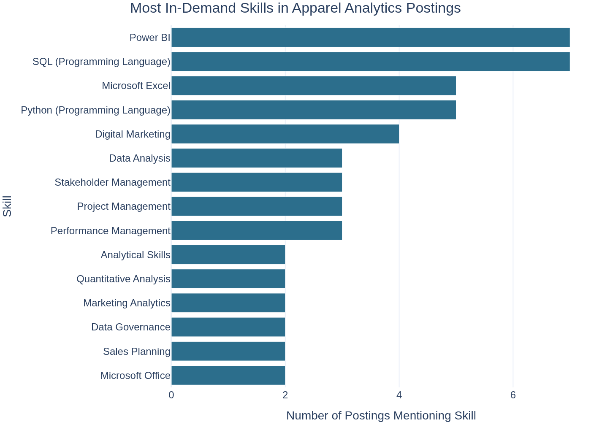](https://zechnschweitzer.github.io/ad688-fashion-apparel-evaluation-group7/skill_gap_analysis.html)

The team rated itself strongest in Excel (4.25) and Data Analysis (4.0), and weakest in Power BI (2.75), Python (2.75), and Digital Marketing (2.75).

[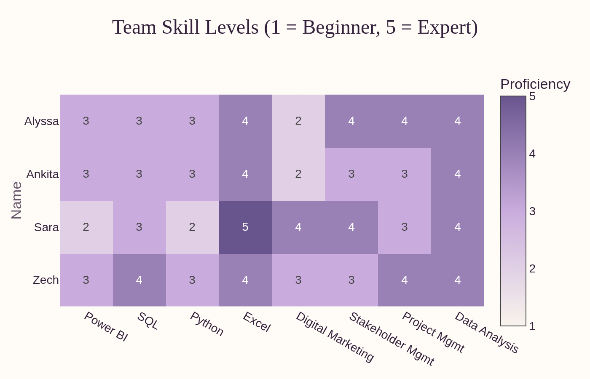](https://zechnschweitzer.github.io/ad688-fashion-apparel-evaluation-group7/skill_gap_analysis.html)

Comparing these averages against market-based targets set Power BI (2.25 gap) and SQL (1.75 gap) as high priority, and Python and Digital Marketing as moderate priority. Excel, Stakeholder Management, Project Management, and Data Analysis all came back as low priority, since the team's average proficiency already meets or exceeds the market-based target for each.

[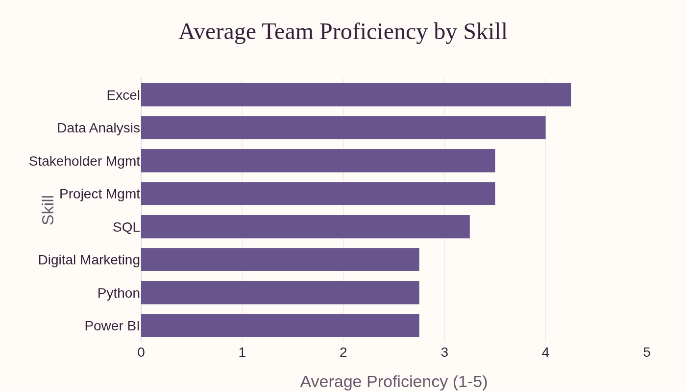](https://zechnschweitzer.github.io/ad688-fashion-apparel-evaluation-group7/skill_gap_analysis.html)

Power BI is the most consistent gap across the team: every member rated it at 3 or below despite it tying for the highest market demand.

[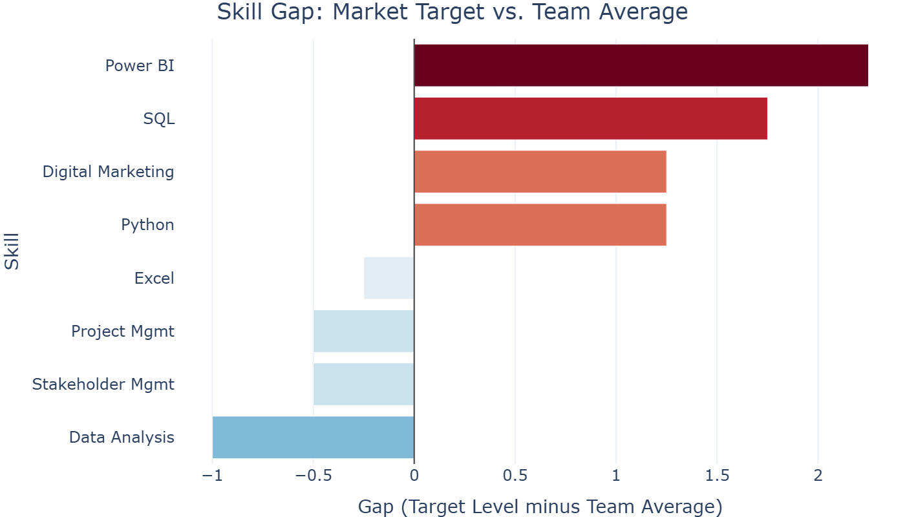](https://zechnschweitzer.github.io/ad688-fashion-apparel-evaluation-group7/skill_gap_analysis.html)

[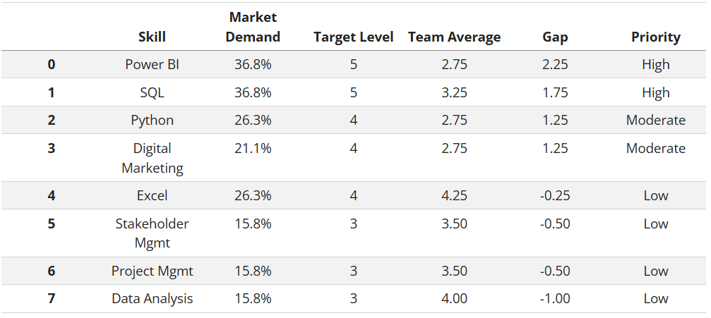](https://zechnschweitzer.github.io/ad688-fashion-apparel-evaluation-group7/skill_gap_analysis.html)

# Career Evaluation

The 19 postings in our filtered dataset do not represent equally strong opportunities for this team, so we evaluate them on three factors: attainability, skill relevance, and employer signal. Experience requirements are not evenly spread: 17 of the 19 postings list a minimum of 0 years of experience, and only 2 list a 5-year minimum, so accessibility is mostly uniform with a couple of high-bar outliers. Skill relevance separates the postings more clearly. We counted how many of the team's four strongest self-rated skills (Data Analysis, Microsoft Excel, Stakeholder Management, Project Management) show up in each posting's listed skills, and found 8 of the 19 postings match none of them, 7 match exactly one, and 4 match two; not a single posting matches three or four. Employer signal is also concentrated: Vuori accounts for 5 of the 19 postings, TJX accounts for 5, and Adidas accounts for 3, so together those three employers make up 13 of 19 postings, or 68 percent, while the remaining six employers in the sample post once each. These three factors feed directly into the Opportunity Scorecard below.

# Final Analytics

The final analysis uses a rule-based Opportunity Scorecard to rank job postings according to skill fit, experience accessibility, and employer signal score. A scorecard was selected over a predictive model because the final dataset had only 19 postings, making it more vulnerable to overfitting. We found the highest-ranked position was the Senior Manager, Ecommerce Analytics role at Vuori, with an opportunity score of 10. The second and third highly ranked positions were Sr. FP&A Manager, Systems & Analytics at Vuori and Director, Wholesale Sales Planning & Analytics at Adidas.

| Title | Company | Skill Fit | Accessibility | Employer Signal | Opportunity Score |
|---|---|---|---|---|---|
| Sr. Manager, Ecommerce Analytics | Vuori | 2 | 3 | 5 | 10 |
| Sr. FP&A Manager, Systems & Analytics | Vuori | 1 | 3 | 5 | 9 |
| Director, Wholesale Sales Planning & Analytics | Vuori | 1 | 3 | 5 | 9 |
| Manager, Digital Marketing Analytics | Adidas | 2 | 3 | 3 | 8 |
| Sr. Manager, Global Finance Business Analyst | Vuori | 0 | 3 | 5 | 8 |
| Product Manager, Enterprise Analytics | Vuori | 1 | 1 | 5 | 7 |
| Sr Region Operations Analyst - Sierra | TJX | 0 | 3 | 3 | 6 |
| Sr. Data Analyst | Foot Locker | 2 | 3 | 1 | 6 |
| Senior Analyst, Merchandise Flow & Analytics | TJX | 0 | 3 | 3 | 6 |
| Manager, Digital Consumer Analytics | Adidas | 2 | 1 | 3 | 6 |
| Media Marketing Sr. Manager, Analytics | Ralph Lauren | 1 | 3 | 2 | 6 |
| Sr Region Operations Analyst - Sierra | TJX | 0 | 3 | 3 | 6 |
| Media Marketing Sr. Manager, Analytics | Ralph Lauren | 1 | 3 | 2 | 6 |
| Manager, Digital Analytics | Adidas | 0 | 3 | 3 | 6 |
| Senior Business Intelligence & Data Analyst - Data Governance | TJX | 0 | 3 | 2 | 5 |
| Senior Business Intelligence & Data Analyst - Data Governance | TJX | 0 | 3 | 2 | 5 |
| Merchandising Data Analyst | Michaels | 1 | 3 | 1 | 5 |
| Data Analyst 3 - Store Operations | Nordstrom | 1 | 3 | 1 | 5 |
| Principal, Data Analytics and Engineering | Macy's | 0 | 3 | 1 | 4 |

The scorecard provides an intuitive method for prioritizing opportunities based on the student's current skill levels and the characteristics found in the job postings. To check the model's internal consistency, we computed the rank correlation between each component and the final Opportunity Score. Employer signal correlates most strongly (0.87), skill fit correlates moderately (0.42), and accessibility correlates essentially not at all (-0.11), confirming that employer signal currently has more influence on the ranking than the other two components, since it is an uncapped raw count rather than a capped 0-to-3 or 0-to-4 score. With this in mind, and considering this is not a predictive model, the scorecard is best interpreted as a career prioritization tool rather than a precise ranking.

| Component | Min | Max | Mean | Correlation with Opportunity Score |
|---|---|---|---|---|
| Skill Fit | 0.00 | 2.00 | 0.79 | 0.42 |
| Accessibility | 1.00 | 3.00 | 2.79 | -0.11 |
| Employer Signal | 1.00 | 5.00 | 2.89 | 0.87 |

# Recommendations 

Given this dataset and our Opportunity Scorecard, we recommend students focus their job search on Vuori and TJX, as they had multiple analytics-adjacent postings, making them the most attainable by volume. Adidas ranked third in posting volume, with positions relying more on skill fit rather than application volume. For location, students have the best chance of finding opportunities in California, Massachusetts, and New York. Students should also focus on developing their Power BI and SQL skills, as they are the most in-demand skills. The third most important skill is Python, though less than half of these postings required it. By person, Alyssa and Ankita should complete a Power BI learning path before the Module 5 deadline, then move to SQL practice against our own filtered dataset. Sara should prioritize Power BI first given her lowest team rating on it, building on her existing Excel strength. Zech should focus on Power BI's data modeling features, building on his existing SQL proficiency.

# Limitations 

As stated before, our working sample is 19 postings from a narrowly filtered search. These recommendations describe this specific sample, not the broader apparel analytics job market. Salary and remote work data were usable for only 4 of 19 postings each, so neither recommendation above can account for compensation or remote work preferences with much confidence. Lastly, the scorecard’s equal weighting of skill fit, accessibility, and employer signal is a modeling choice, not a validated weighting scheme.

# Team Contributions

This project was a collaborative effort across all four team members. Each person contributed to data preparation, analysis, website development, and the final report, and the team connected regularly throughout the modules to divide tasks, review each other's work, and keep the site consistent from page to page. All team members are able to speak to the full product, not just one section.

| Member | Contribution |
|---|---|
| Alyssa Quigley | Data preparation, analysis, and website development |
| Ankita Roy | Data preparation, analysis, and website development |
| Zechariah Schweitzer | Data preparation, analysis, and website development |
| Sara Scribner | Data preparation, analysis, and website development |

# References {.unnumbered}

::: {#refs}
:::

